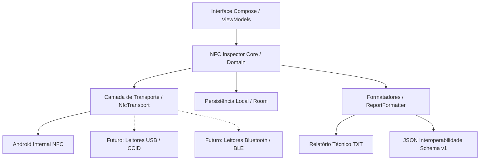
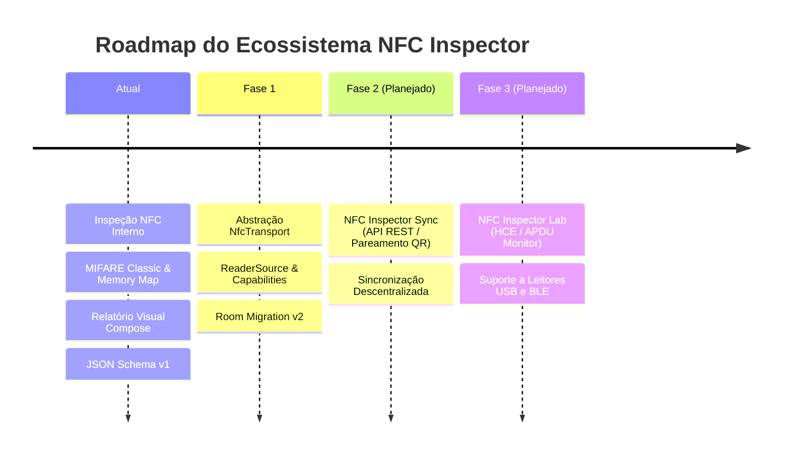

# NFC Inspector — Arquitetura de Software & Guia de Engenharia

Este documento descreve a arquitetura técnica, os princípios de design, os modelos de dados e a estratégia de evolução do **NFC Inspector**.

---

## 1. Visão Geral da Arquitetura

O **NFC Inspector** é construído sob os princípios de **Clean Architecture**, **Offline-First** e **Baixo Acoplamento**, garantindo que operações de inspeção de protocolos NFC, formatação de relatórios e persistência local sejam completamente independentes de hardware ou fornecedores de nuvem.



---

## 2. Abstrações Principais

### 2.1 Separação entre Transporte e Protocolo

* **Transporte (`NfcTransport`)**: Responsável pela conexão física/lógica e transmissão bruta de bytes (`transceive`). Não interpreta a semântica do cartão.
* **Protocolo**: Interpreta estruturas de dados e regras de comando/resposta de cada padrão (ISO 14443-3A/B, ISO 14443-4 ISO-DEP, MIFARE Classic/Ultralight, NDEF, JIS 6319-4, ISO 15693).

```kotlin
interface NfcTransport {
    val source: ReaderSource
    val capabilities: ReaderCapabilities
    val isConnected: Boolean
}
```

### 2.2 Origem da Leitura (`ReaderSource`)

Toda leitura é anotada com a fonte exata que executou a aquisição (`ReaderSource`), permitindo rastreabilidade precisa quando múltiplos leitores estiverem disponíveis:

```kotlin
enum class ReaderSourceType(val displayName: String, val wireName: String) {
    ANDROID_NFC("NFC Interno Android", "android_nfc"),
    USB("Leitor USB Externo", "usb"),
    BLUETOOTH("Leitor Bluetooth", "bluetooth"),
    REMOTE("Leitor de Rede / Remoto", "remote"),
    IMPORTED("Arquivo / Importação", "imported"),
    UNKNOWN("Desconhecido", "unknown")
}
```

### 2.3 Capacidades do Leitor (`ReaderCapabilities`)

Permite que a interface e os motores de protocolo consultem as funcionalidades suportadas pelo adaptador ativo sem suposições rígidas sobre o hardware:

* `READ`: Leitura padrão de identificadores e dados abertos.
* `WRITE`: Capacidade de gravação de blocos/NDEF.
* `ISO_DEP`: Envio de APDUs ISO/IEC 7816-4.
* `MIFARE_CLASSIC`: Suporte a comandos proprietários Crypto-1 e autenticação por chaves de 48 bits.
* `NDEF`: Leitura e escrita de mensagens NDEF.
* `ISO_15693` / `FELICA`: Protocolos de proximidade estendida e alta velocidade.
* `RAW_TRANSCEIVE`: Envio de frames brutos.
* `HCE`: Emulação de cartão baseada em host.

### 2.4 Identificador Único de Leitura (`scanId`)

Cada leitura recebe um identificador globalmente estável `scanId` (UUID v4), garantindo:
1. **Deduplicação** no histórico e exportações;
2. **Sincronização Segura** com futuras instâncias do *NFC Inspector Sync*;
3. **Imutabilidade** do registro técnico.

---

## 3. Camada de Persistência & Migração (Room)

O aplicativo armazena históricos localmente em SQLite via Room com migração determinística:

### Esquema de Banco de Dados (`scanned_tags`)

| Coluna | Tipo SQLite | Descrição |
| :--- | :--- | :--- |
| `id` | `INTEGER PRIMARY KEY AUTOINCREMENT` | Chave primária local |
| `scanUuid` | `TEXT NOT NULL` | UUID global único da leitura (`scanId`) |
| `timestamp` | `INTEGER NOT NULL` | Timestamp em milissegundos |
| `readerSourceType` | `TEXT NOT NULL` | Código da fonte (`ANDROID_NFC`, `USB`, etc.) |
| `readerName` | `TEXT NOT NULL` | Nome descritivo do leitor |
| `readerId` | `TEXT NOT NULL` | Identificador do hardware |
| `uidColonHex` | `TEXT NOT NULL` | UID formatado com dois-pontos |
| `uidContinuousHex` | `TEXT NOT NULL` | UID contínuo em hexadecimal |
| `uidDecimal` | `TEXT NOT NULL` | UID convertido para base decimal |
| `uidLengthBytes` | `INTEGER NOT NULL` | Tamanho do UID em bytes |
| `mainTechnology` | `TEXT NOT NULL` | Classificação técnica principal |
| `technologiesCsv` | `TEXT NOT NULL` | Lista de tecnologias detectadas |
| `nfcAJson`, etc. | `TEXT` | Parâmetros serializados de tecnologias específicas |
| `fullReport` | `TEXT NOT NULL` | Relatório textual completo gerado |

### Estratégia de Migração (`MIGRATION_1_2`)

Adição não-destrutiva de colunas com valores padrão retrocompatíveis para bancos pré-existentes.

---

## 4. Esquema de Interoperabilidade JSON (Schema v1)

O formato JSON gerado por `ReportFormatter.generateJsonExport()` segue o Schema v1:

```json
{
  "schemaVersion": 1,
  "scanId": "a8f3b2c1-9e4a-4f5a-b6d8-123456789abc",
  "generator": {
    "name": "NFC Inspector",
    "platform": "Android"
  },
  "reader": {
    "source": "android_nfc",
    "name": "NFC Interno Android",
    "transport": "android_nfc",
    "id": "internal_android_adapter"
  },
  "capturedAt": "2026-08-16T15:30:00Z",
  "capturedAtTimestamp": 1773000000000,
  "inspectionStatus": "complete",
  "tag": {
    "uid": {
      "hexColon": "04:5A:B2:1A",
      "hex": "045AB21A",
      "decimal": "73052698",
      "lengthBytes": 4,
      "lengthBits": 32
    },
    "mainTechnology": "MIFARE Classic 1K",
    "technologies": ["NfcA", "MifareClassic"],
    "isNdefFormatable": false
  }
}
```

---

## 5. Diretrizes de Segurança & Privacidade

1. **Operação 100% Offline**: Nenhuma telemetria, rastreador, IMEI, Android ID ou conexão silenciosa com servidores.
2. **Sanitização de Chaves Criptográficas**: Chaves secretas MIFARE (Key A / Key B) utilizadas durante a autenticação **NUNCA** são gravadas em texto puro nos relatórios, JSON ou logs exportáveis.
3. **Privacidade de Armazenamento**: O banco de dados local reside estritamente no armazenamento privado do aplicativo (`context.getDatabasePath(...)`).

---

## 6. Roadmap de Evolução



### 6.1 NFC Inspector Core
* Expansão dos analisadores de tags (ISO 15693 Vicinity, FeliCa avançado, ISO-DEP APDU scripts).
* Motor de diagnósticos e recomendações de segurança.

### 6.2 NFC Inspector Sync (Planejado)
* API REST leve e pareamento ponta-a-ponta via QR Code.
* Sincronização de tags e relatórios entre dispositivos móveis e desktops de auditoria.
* Funcionamento offline-first com reconciliação por `scanId`.

### 6.3 NFC Inspector Lab (Planejado)
* Emulação de cartões via Host Card Emulation (HCE) para perfis ISO-DEP / NDEF.
* **Nota Técnica**: Cartões MIFARE Classic operam com modulação proprietária e framing incompatível com a pilha HCE padrão do Android (que atua apenas em ISO 14443-4 / ISO-DEP). O Lab indicará claramente as limitações de emulação suportadas pela plataforma.
